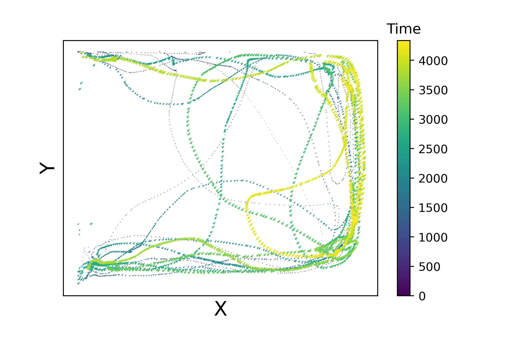

# Repetitive behaviour anaysis




### parameters:
* Input data: X and Y
    - X: animal movement along x axis across time (X= X(t)).     
    - Y: animal movement along Y axis across time (Y= Y(t)). 
* win size:
    - Time window size for clculation of the statistical parameters values in that interval.
   
### Return:
* 1. Repitition index ( result.repetition_idx )
* 2. Repetitive movements duration ( result.cycling_set )


## Testing the library on an example data:

```python
>> from trajectory import *
>> result = trajectory(X , Y , win = 500, cutting_threshold = 700)
>> print(result.repetition_idx)
     0.18703874538745388
>> print(result.cycling_set)
    {0: [0, 374], 1: [422, 476], 2: [497, 1308], 3: [1310, 1698], 4: [1715, 1985], 5: [2002, 2357], 6: [2364, 2721], 7: [2775, 2796], 8: [2820, 3229], 9: [3275, 3747]}
'''
