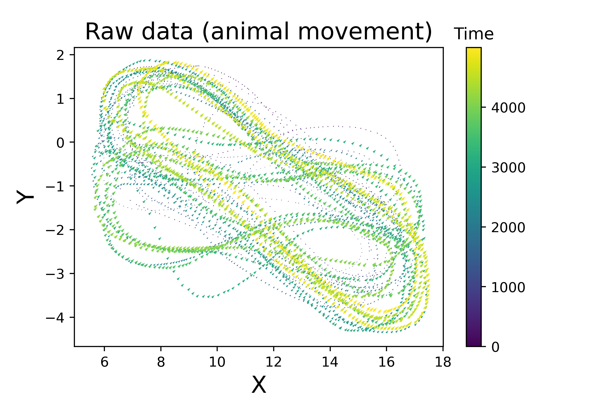

# Repetitive behaviour anaysis


 


### parameters:
* Input data: X and Y
    - X: animal movement along x axis across time (X= X(t)).     
    - Y: animal movement along Y axis across time (Y= Y(t)). 
* win size:
    - Time window size for clculation of the statistical parameters values in that interval.
   
### Return:
* 1. Repitition index ( result.repetition_idx )
* 2. Repetitive movements duration ( result.cycling_set )


## Testing the library on an example data:

```python
>> from trajectory import *
>> result = trajectory(X , Y , win = 500, cutting_threshold = 700)
>> print(result.repetition_idx)
     0.73114622
>> print(result.cycling_set)
    {0: [0, 206], 1: [225, 379], 2: [380, 445], 3: [451, 823], 4: [833, 2645], 5: [2655, 4498]}

