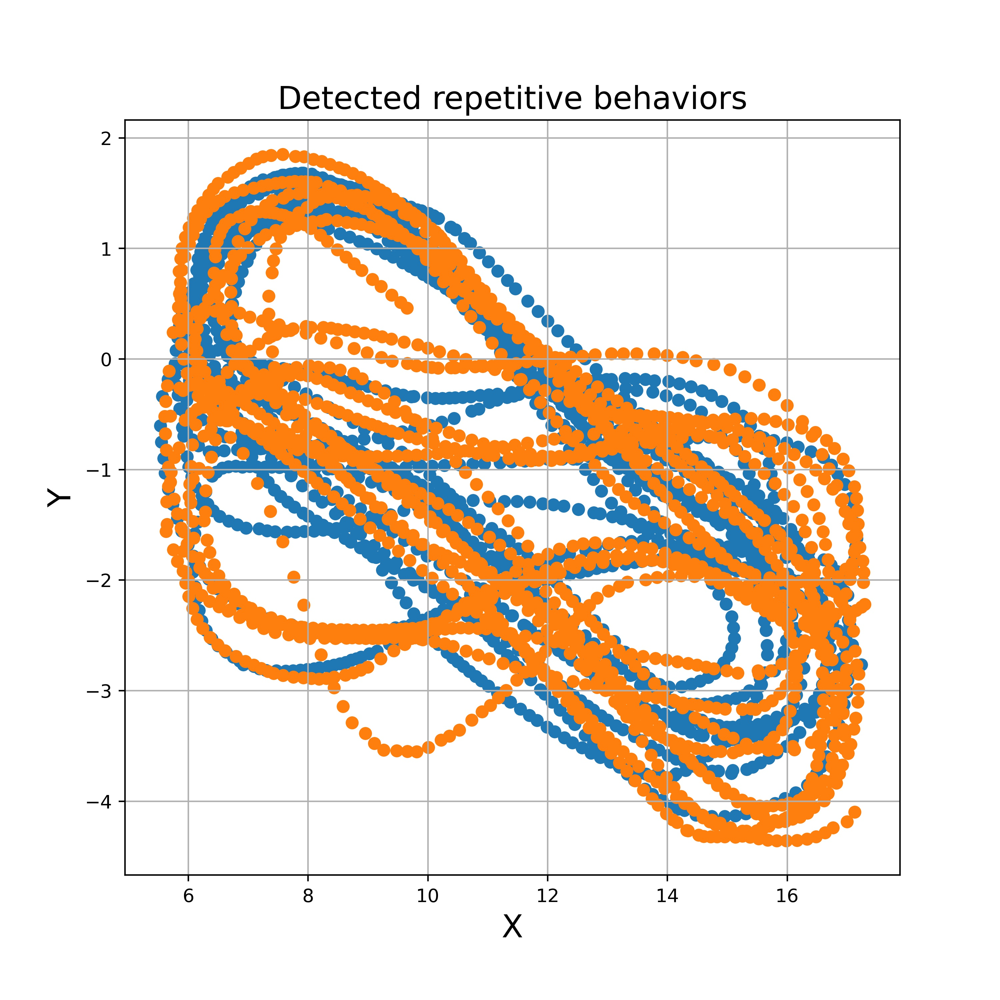

## Dahlén, Amelia, Mahdi Zarei, Adam Melgoza, Mahendra Wagle, and Su Guo. "THC-induced behavioral stereotypy in zebrafish as a model of psychosis-like behavior." Scientific reports 11, no. 1 (2021): 1-13.
## Click onn the [link](https://www.nature.com/articles/s41598-021-95016-4) to see the manuscript.


```python
@article{dahlen2021thc,
  title={THC-induced behavioral stereotypy in zebrafish as a model of psychosis-like behavior},
  author={Dahl{\'e}n, Amelia and Zarei, Mahdi and Melgoza, Adam and Wagle, Mahendra and Guo, Su},
  journal={Scientific reports},
  volume={11},
  number={1},
  pages={1--13},
  year={2021},
  publisher={Nature Publishing Group}
}
```

# Repetitive behaviour anaysis

## Calculate the Repetition Index (RI) for an example trajectory data:

### parameters:

* Input data: X and Y
    - X: animal movement along x axis across time (X= X(t)).     
    - Y: animal movement along Y axis across time (Y= Y(t)). 
* win size:
    - Time window size for clculation of the statistical parameters values in that interval.
   
* Return:
* 1. Repitition index ( result.repetition_idx )
* 2. Repetitive movements duration ( result.cycling_set )


```python

>> from trajectory import *
>> result = trajectory(X , Y , win = 500, cutting_threshold = 700)
>> print(result.repetition_idx)
     0.73114622
>> print(result.cycling_set)
    {0: [0, 206], 1: [225, 379], 2: [380, 445], 3: [451, 823], 4: [833, 2645], 5: [2655, 4498]}
    
```


 

